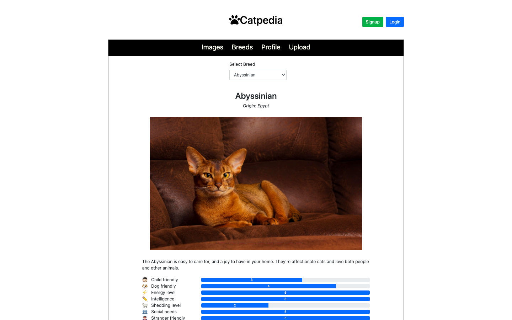

# Catpedia 🐈

## About
Cat Encyclopedia where users can find and upload cat images, and get information about cat breeds.

Key features:

* create an account and follow other users.
* find random cat images.
* save favorite images and see other users' favorites.
* upload cat images.
* select cat breed and see the details of the breed.

## Technologies and stack

* Frontend: React, Reactstrap
* Backend: Ruby/Ruby on Rails
* Database: Postgresql
* External API: TheCatAPI(https://thecatapi.com/)
